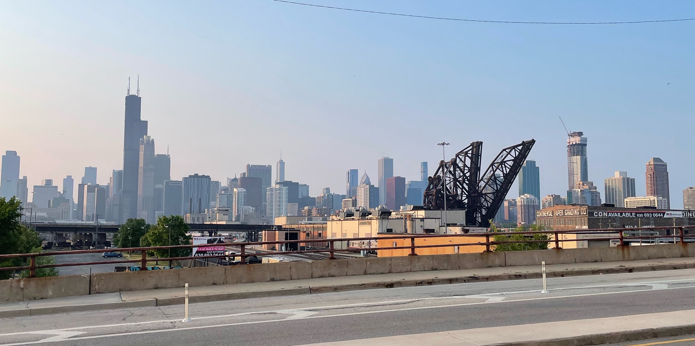

# About Me

My fascination with cities and their intricacies began during my high school days as a budding journalist, where I explored history, politics, and challenges present in Chicago and its neighborhoods. This passion for telling stories led me to the world of data analysis, realizing that it offered a unique perspective into the underlying systems and processes shaping urban life.

As a data analyst with a specialization in spatial data, I've honed my skills at the University of Chicago Urban Labs, the Field Museum, the Center for Spatial Data Science, and now at RTI International. I apply my expertise to public health research, addressing pressing issues such as opioid overdoses, policing, and environmental concerns.

My mission is to use spatial data analysis to contribute to the development of more equitable and sustainable urban environments. By making data accessible and understandable to the public through open-source projects and data-driven storytelling, I aim to empower citizens to make informed decisions and create positive change in their communities.

For more details, check out my [resume](resume.pdf).
